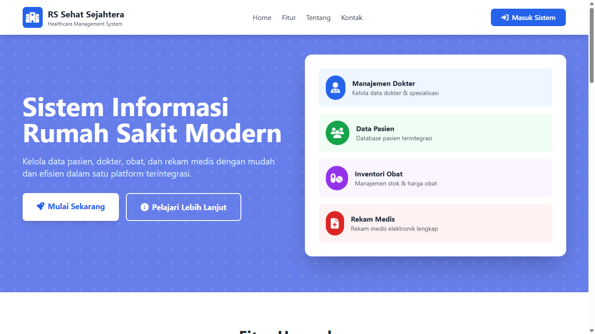
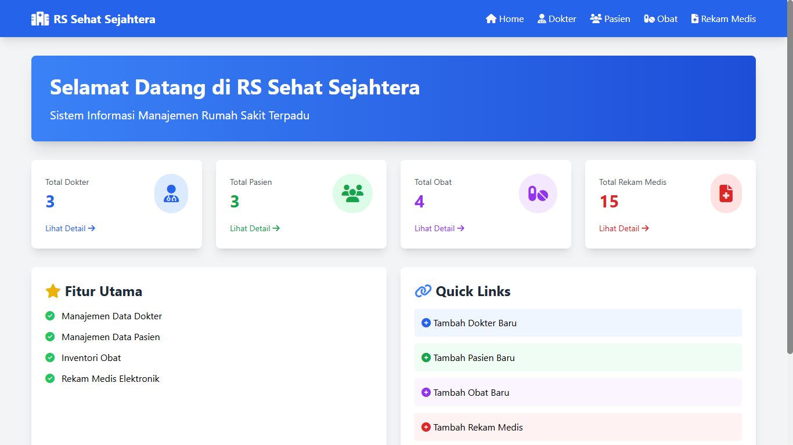
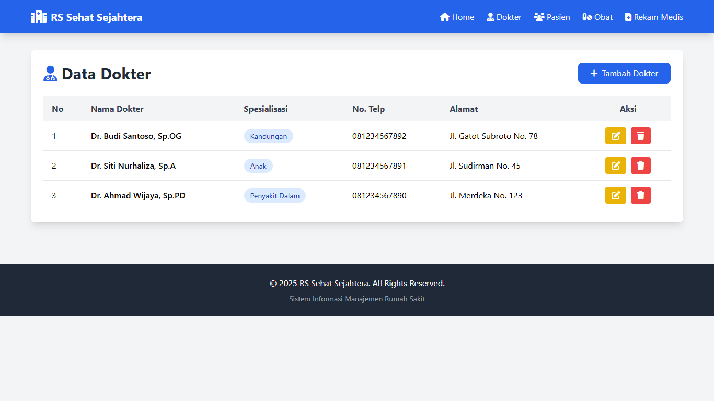
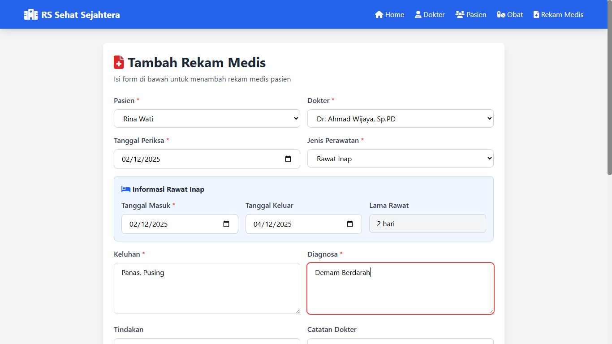
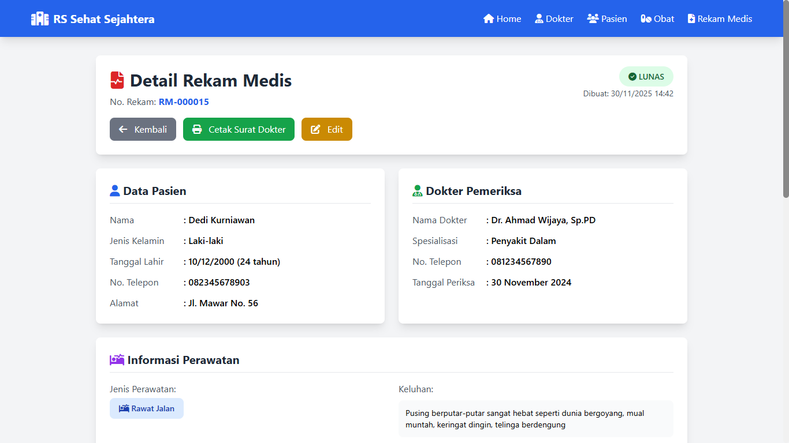
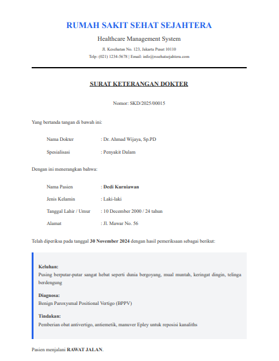
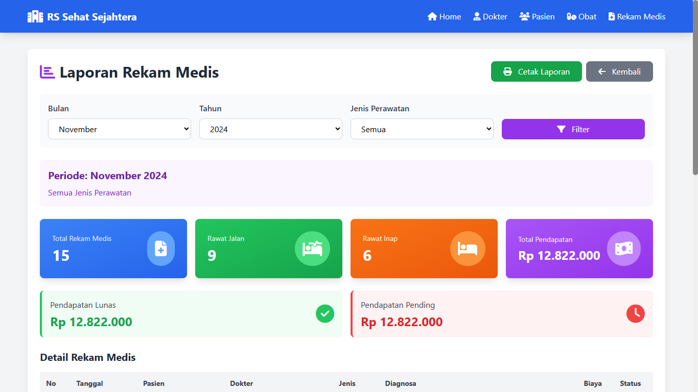

# 🏥 Sistem Informasi Rumah Sakit - RS Sehat Sejahtera


Sistem Informasi Manajemen Rumah Sakit berbasis web yang dibangun dengan PHP Native, MySQL, dan Tailwind CSS. Aplikasi ini menyediakan fitur lengkap untuk mengelola data dokter, pasien, obat, dan rekam medis dengan antarmuka yang modern dan responsif.

---

## 👥 Kelompok 1 - Anggota Tim

1. **Abiyyu Naufal Muhammad**
2. **Aditya Rahman Saputra**
3. **Aflah Syamsul Awaludin**
4. **Andhella Aulia Putra**
5. **Andhika Nur Hidayah**
6. **Bismarck Dominick Josiah Hasud**
7. **Dafa Prasetyo**
8. **Damar Dwiyanto**
9. **Delia Maylani**

---

## 📋 Daftar Isi

- [Fitur Utama](#-fitur-utama)
- [Teknologi yang Digunakan](#-teknologi-yang-digunakan)
- [Struktur Database](#-struktur-database)
- [Instalasi](#-instalasi)
- [Cara Penggunaan](#-cara-penggunaan)
- [Screenshot](#-screenshot)
- [Struktur Folder](#-struktur-folder)
- [Kontribusi](#-kontribusi)
- [Lisensi](#-lisensi)

---

## ✨ Fitur Utama

### 🏠 Landing Page
- Desain modern dan menarik
- Informasi fitur aplikasi
- Section tentang rumah sakit
- Kontak informasi
- Call-to-action untuk masuk sistem

### 📊 Dashboard
- Statistik real-time (Total Dokter, Pasien, Obat, Rekam Medis)
- Quick access ke semua modul
- Cards dengan visualisasi data
- Responsive design

### 👨‍⚕️ Manajemen Dokter
- ✅ Tambah data dokter baru
- ✅ Lihat daftar dokter
- ✅ Edit informasi dokter
- ✅ Hapus data dokter
- 📋 Informasi: Nama, Spesialisasi, No. Telp, Alamat

### 👤 Manajemen Pasien
- ✅ Tambah data pasien baru
- ✅ Lihat daftar pasien
- ✅ Edit informasi pasien
- ✅ Hapus data pasien
- 📋 Informasi: Nama, Tanggal Lahir, Jenis Kelamin, No. Telp, Alamat

### 💊 Manajemen Obat
- ✅ Tambah obat baru
- ✅ Lihat daftar obat
- ✅ Edit informasi obat
- ✅ Hapus data obat
- 📋 Informasi: Nama Obat, Jenis, Stok, Harga
- 🔔 Alert stok rendah (< 20)

### 📝 Rekam Medis Elektronik (EMR)
#### Fitur Utama:
- ✅ Jenis Perawatan: **Rawat Jalan** & **Rawat Inap**
- ✅ Informasi Rawat Inap:
  - Tanggal Masuk & Keluar
  - Hitung durasi rawat inap otomatis
  - Biaya rawat inap (Rp 300.000/hari)
- ✅ Data Lengkap:
  - Keluhan pasien
  - Diagnosa dokter
  - Tindakan medis
  - Resep obat
  - Catatan dokter
- ✅ Perhitungan Biaya Otomatis:
  - Biaya konsultasi: Rp 150.000
  - Biaya rawat inap (jika ada)
  - Biaya obat
  - Total biaya
- ✅ Status Pembayaran (Lunas/Belum Lunas)
- ✅ Update stok obat otomatis

#### 🖨️ Cetak Surat Keterangan Dokter
- Format surat resmi dengan KOP rumah sakit
- Nomor surat otomatis
- Informasi lengkap pasien dan diagnosa
- TTD dokter
- Siap cetak (Print-friendly)

#### 📊 Laporan & Statistik
- Filter per bulan dan tahun
- Filter jenis perawatan
- Statistik visual:
  - Total rekam medis
  - Rawat jalan vs rawat inap
  - Total pendapatan
  - Pendapatan lunas vs pending
- Tabel detail transaksi
- Export/Print laporan

---

## 🛠️ Teknologi yang Digunakan

| Teknologi | Versi | Deskripsi |
|-----------|-------|-----------|
| PHP       | 7.4+  | Backend logic & server-side processing |
| MySQL     | 5.7+  | Database management system |
| Tailwind CSS | 3.x | Modern CSS framework via CDN |
| Font Awesome | 6.4.0 | Icon library |
| JavaScript | ES6+ | Client-side interactivity |

---

## 🗄️ Struktur Database

### Tabel yang Digunakan:

#### 1. `dokter`
```sql
- id_dokter (PK)
- nama_dokter
- spesialisasi
- no_telp
- alamat
- created_at
```

#### 2. `pasien`
```sql
- id_pasien (PK)
- nama_pasien
- tanggal_lahir
- jenis_kelamin
- no_telp
- alamat
- created_at
```

#### 3. `obat`
```sql
- id_obat (PK)
- nama_obat
- jenis_obat
- stok
- harga
- created_at
```

#### 4. `rekam_medis`
```sql
- id_rekam (PK)
- id_pasien (FK)
- id_dokter (FK)
- id_obat (FK, nullable)
- tanggal_periksa
- jenis_perawatan (Rawat Jalan/Rawat Inap)
- tanggal_masuk (nullable)
- tanggal_keluar (nullable)
- lama_rawat
- keluhan
- diagnosa
- tindakan
- catatan_dokter
- jumlah_obat
- biaya_konsultasi
- biaya_rawat_inap
- biaya_obat
- biaya_total
- status_pembayaran (Lunas/Belum Lunas)
- created_at
```

### Relasi Database:
- `rekam_medis.id_pasien` → `pasien.id_pasien` (Many-to-One)
- `rekam_medis.id_dokter` → `dokter.id_dokter` (Many-to-One)
- `rekam_medis.id_obat` → `obat.id_obat` (Many-to-One, Optional)

---

## 📥 Instalasi

### Prasyarat
- XAMPP (atau Apache + MySQL + PHP)
- Web Browser modern (Chrome, Firefox, Edge)
- Text Editor (VS Code, Sublime, Notepad++)

### Langkah Instalasi

1. **Download File**

   Download ZIP/RAR dan extract ke folder `htdocs`

2. **Pindahkan ke Folder htdocs**
   ```
   C:/xampp/htdocs/hospital-app/
   ```

3. **Import Database**
   - Buka phpMyAdmin: `http://localhost/phpmyadmin`
   - Klik "New" untuk membuat database baru
   - Nama database: `rumahsakit_db`
   - Klik tab "Import"
   - Pilih file `database.sql` dari folder project
   - Klik "Go"

4. **Konfigurasi Database (Opsional)**
   
   Jika menggunakan username/password MySQL yang berbeda, edit file `config/database.php`:
   ```php
   define('DB_HOST', 'localhost');
   define('DB_USER', 'root');        // Ganti sesuai username MySQL Anda
   define('DB_PASS', '');             // Ganti sesuai password MySQL Anda
   define('DB_NAME', 'rumahsakit_db');
   ```

5. **Jalankan Aplikasi**
   - Start Apache dan MySQL di XAMPP Control Panel
   - Buka browser dan akses: `http://localhost/hospital-app`
   - Landing page akan tampil

---

## 🚀 Cara Penggunaan

### Akses Aplikasi
1. Buka browser dan kunjungi: `http://localhost/hospital-app`
2. Akan muncul **Landing Page**
3. Klik tombol **"Masuk Sistem"** untuk ke Dashboard

### Workflow Umum

#### 1️⃣ Setup Data Master
1. **Tambah Dokter**
   - Masuk menu Dokter → Tambah Dokter
   - Isi: Nama, Spesialisasi, No. Telp, Alamat
   - Klik "Simpan"

2. **Tambah Pasien**
   - Masuk menu Pasien → Tambah Pasien
   - Isi: Nama, Tanggal Lahir, Jenis Kelamin, No. Telp, Alamat
   - Klik "Simpan"

3. **Tambah Obat**
   - Masuk menu Obat → Tambah Obat
   - Isi: Nama Obat, Jenis, Stok, Harga
   - Klik "Simpan"

#### 2️⃣ Buat Rekam Medis

**Untuk Rawat Jalan:**
1. Menu Rekam Medis → Tambah Rekam Medis
2. Pilih Pasien dan Dokter
3. Jenis Perawatan: "Rawat Jalan"
4. Isi Keluhan, Diagnosa, Tindakan, Catatan
5. Pilih Obat (jika ada)
6. Status Pembayaran
7. Lihat total biaya otomatis
8. Klik "Simpan"

**Untuk Rawat Inap:**
1. Menu Rekam Medis → Tambah Rekam Medis
2. Pilih Pasien dan Dokter
3. Jenis Perawatan: "Rawat Inap"
4. Isi Tanggal Masuk dan Tanggal Keluar
5. Lama rawat akan otomatis terhitung
6. Isi data lainnya
7. Biaya akan otomatis termasuk biaya rawat inap
8. Klik "Simpan"

#### 3️⃣ Lihat Detail & Cetak Surat
1. Menu Rekam Medis → Klik tombol mata (👁️) pada data
2. Lihat detail lengkap rekam medis
3. Klik "Cetak Surat Dokter"
4. Surat Keterangan Dokter siap dicetak

#### 4️⃣ Lihat Laporan
1. Menu Rekam Medis → Tombol "Laporan"
2. Filter berdasarkan:
   - Bulan
   - Tahun
   - Jenis Perawatan
3. Lihat statistik dan detail transaksi
4. Klik "Cetak Laporan" untuk print

---

## 📸 Screenshot

### Landing Page

*Landing page modern dengan informasi lengkap tentang aplikasi*

### Dashboard

*Dashboard dengan statistik real-time dan quick access*

### Daftar Dokter

*Manajemen data dokter dengan fitur CRUD lengkap*

### Form Rekam Medis

*Form rekam medis dengan fitur rawat inap dan perhitungan otomatis*

### Detail Rekam Medis

*Tampilan detail lengkap rekam medis pasien*

### Surat Keterangan Dokter


*Surat keterangan dokter siap cetak*

### Laporan

*Laporan lengkap dengan statistik dan filter*

> **Note:** Silakan tambahkan screenshot aktual di folder `screenshot/`

---

## 📁 Struktur Folder

```
hospital-app/
│
├── config/
│   └── database.php              # Konfigurasi koneksi database
│
├── includes/
│   ├── header.php                # Header & Navbar
│   └── footer.php                # Footer
│
├── pages/
│   ├── dokter/
│   │   ├── index.php             # Daftar dokter
│   │   ├── tambah.php            # Form tambah dokter
│   │   ├── edit.php              # Form edit dokter
│   │   └── hapus.php             # Proses hapus dokter
│   │
│   ├── pasien/
│   │   ├── index.php             # Daftar pasien
│   │   ├── tambah.php            # Form tambah pasien
│   │   ├── edit.php              # Form edit pasien
│   │   └── hapus.php             # Proses hapus pasien
│   │
│   ├── obat/
│   │   ├── index.php             # Daftar obat
│   │   ├── tambah.php            # Form tambah obat
│   │   ├── edit.php              # Form edit obat
│   │   └── hapus.php             # Proses hapus obat
│   │
│   └── rekam_medis/
│       ├── index.php             # Daftar rekam medis
│       ├── tambah.php            # Form tambah rekam medis
│       ├── edit.php              # Form edit rekam medis
│       ├── hapus.php             # Proses hapus rekam medis
│       ├── detail.php            # Detail rekam medis
│       ├── surat.php             # Cetak surat dokter
│       └── report.php            # Laporan & statistik
│
├── assets/
│   ├── css/
│   │   └── style.css             # Custom CSS (optional)
│   ├── js/
│   │   └── script.js             # Custom JavaScript (optional)
│   └── images/                   # Semua Gambar (logo, icon, foto)
│
├── landing.php                   # Landing page
├── index.php                     # Router (redirect ke landing)
├── dashboard.php                 # Dashboard utama
├── database.sql                  # File SQL database
└── README.md                     # Dokumentasi (file ini)
```

---

## 🎯 Fitur Unggulan

### 1. **Auto-Calculate Biaya**
Sistem secara otomatis menghitung:
- Biaya konsultasi dokter
- Biaya rawat inap berdasarkan jumlah hari
- Biaya obat berdasarkan harga × jumlah
- Total biaya keseluruhan

### 2. **Manajemen Stok Obat**
- Stok otomatis berkurang saat rekam medis dibuat
- Alert visual untuk stok rendah (< 20)
- Update stok saat edit/hapus rekam medis

### 3. **Responsive Design**
- Mobile-friendly
- Tampilan optimal di desktop, tablet, dan smartphone
- Hamburger menu untuk mobile

### 4. **Print-Friendly**
- Surat dokter dengan format profesional
- Laporan siap cetak
- CSS khusus untuk printing

### 5. **User-Friendly Interface**
- Navigasi intuitif
- Feedback visual (alert success/error)
- Konfirmasi sebelum hapus data
- Loading indicator

---

## 🔒 Keamanan

- ✅ SQL Injection protection (mysqli_real_escape_string)
- ✅ XSS protection (htmlspecialchars)
- ✅ Input validation
- ✅ Prepared statements ready

> **Note:** Untuk production, disarankan menambahkan:
> - Authentication & Authorization system
> - Password hashing
> - CSRF protection
> - Session management
> - Input sanitization lebih ketat

---

## 🐛 Troubleshooting

### Error: "Koneksi database gagal"
**Solusi:**
- Pastikan Apache dan MySQL di XAMPP sudah running
- Cek konfigurasi di `config/database.php`
- Pastikan database `rumahsakit_db` sudah dibuat

### Error: "Page not found" / 404
**Solusi:**
- Pastikan folder berada di `C:/xampp/htdocs/hospital-app/`
- Akses dengan URL yang benar: `http://localhost/hospital-app`

### Error: "Table doesn't exist"
**Solusi:**
- Import ulang file `database.sql` di phpMyAdmin
- Pastikan semua tabel ter-create dengan benar

### Tampilan berantakan / CSS tidak load
**Solusi:**
- Periksa koneksi internet (Tailwind CSS via CDN)
- Clear browser cache
- Pastikan path CSS sudah benar

---

## 📄 Lisensi

Proyek ini dibuat untuk keperluan edukasi dan tugas kelompok.

© 2024 Kelompok 1 - Sistem Informasi Rumah Sakit

---

## 📞 Kontak

Untuk pertanyaan atau bantuan, silakan hubungi anggota tim:

**Kelompok 1 - Aplikasi Rumah Sakit**

---

## 🙏 Acknowledgments

- Tailwind CSS untuk framework CSS modern
- Font Awesome untuk icon library
- XAMPP untuk development environment
- Seluruh anggota tim yang telah berkontribusi

---

<div align="center">

**⭐ Jangan lupa beri bintang jika project ini bermanfaat! ⭐**

Made with ❤️ by Kelompok 1

</div>